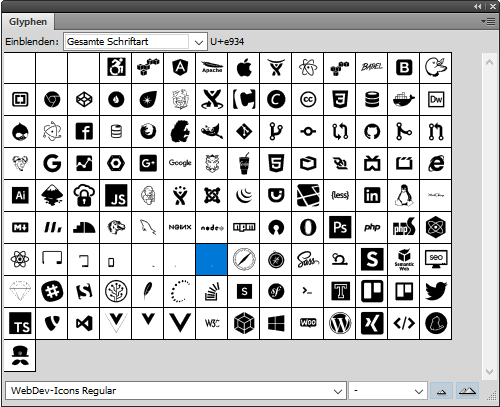

# WebDev-Icons

A font to iconify a Webdevelopers Skills currently including 124 plain, monochrome Icons in Version 1.0. Including Programming Languages, Frameworks, Workflow Tools, Programs/IDE´s etc.

There are currently no Plans to include alternativ Versions and/or to integrate full colored Versions. There are other Alternatives for that.

<a href="https://github.com/Thomas-A-Reinert/WebDev-Icons/archive/master.zip" title="Download WebDev-Icons"></a>

## Alternatives

There is a Bunch of pretty awesome Font Libraries that I can really recommend.

Problem is: None of them included all the Icons I needed for my personal Portfolio so I created my own.

If you´re looking for more Font Libraries that also include different Versions for some of the Icons or are even multi-colored, you should take a look at those Libs:

* [Devicon 2.0](https://github.com/konpa/devicon/)
* [Devicons](http://vorillaz.github.io/devicons)
* [Technology Icons](https://github.com/websiddu/technology-icons)

## How to Use *WebDev-Icons* on your Website

The naming conventions of *WebDev-Icons* are plain and simple:

* all Icons are prefixed with *`webdev-`*.
* Look up the Icon names in `/src/PNG` to see the Icons and find out their respective names.
* Example: You need to embed a "Jira" Icon. Check the above mentioned directory and you´ll find a file named `jira.png`. So the complete name for the icon class would be `webdev-jira`

### Using the Icon Font
* Upload *webdev-icons.css* (/dist/webdev-icons.css) and *fonts* Folder (/dist/fonts) to your Site.

```html
  <link rel="stylesheet" href="webdev-git.css">
```

Adjust paths in your *webdev-git.css* if required.

* Add the respective icon using an `<i>`-Tag

```html
<!--  Example using Github-Icon -->
<i class="webdev-github"></i>

<!--
    Consider improving accessibility!
    In case you´re using e.g. Bootstrap you should use Icons this way:
-->
<i class="webdev-github">
    <span class="sr-only">Git</span>
</i>

```

### Using SVG Icons

```diff
- Notice: This doesn´t really work yet, please be patient and wait for the next update.
+ Thank you!
```

* Copy and paste the SVG Code (open the File with a Text-Editor) of the Icon you´ll want to integrate (from the [*/src/SVG* Folder](src/SVG))

```html
<!--  Example using Github-Icon -->
<svg version="1.1" xmlns="http://www.w3.org/2000/svg" width="32" height="32" viewBox="0 0 32 32">
<title>github</title>
<path d="M16 5.343c-6.196 0-11.219 5.023-11.219 11.219 0 4.957 3.214 9.162 7.673 10.645 0.561 0.103 0.766-0.244 0.766-0.54 0-0.267-0.010-1.152-0.016-2.088-3.12 0.678-3.779-1.323-3.779-1.323-0.511-1.296-1.246-1.641-1.246-1.641-1.020-0.696 0.077-0.682 0.077-0.682 1.126 0.078 1.72 1.156 1.72 1.156 1.001 1.715 2.627 1.219 3.265 0.931 0.102-0.723 0.392-1.219 0.712-1.498-2.49-0.283-5.11-1.246-5.11-5.545 0-1.226 0.438-2.225 1.154-3.011-0.114-0.285-0.501-1.426 0.111-2.97 0 0 0.941-0.301 3.085 1.15 0.894-0.25 1.854-0.373 2.807-0.377 0.953 0.004 1.913 0.129 2.809 0.379 2.14-1.453 3.083-1.15 3.083-1.15 0.613 1.545 0.227 2.685 0.112 2.969 0.719 0.785 1.153 1.785 1.153 3.011 0 4.31-2.624 5.259-5.123 5.537 0.404 0.348 0.761 1.030 0.761 2.076 0 1.5-0.015 2.709-0.015 3.079 0 0.299 0.204 0.648 0.772 0.538 4.455-1.486 7.666-5.69 7.666-10.645 0-6.195-5.023-11.219-11.219-11.219z"></path>
</svg>
```

* Add according CSS Rules to your Stylesheet

```css
.webdev-github {
  max-width: 100%;
  width: 2.5rem; /* Or whatever you find suitable */
}

/* To change Colors you´ll need to add some more CSS */
.webdev-github path {
  fill: #FF0000; /* Or whatever Color you find suitable */
}
```

## How to Use *WebDev-Icons* in Documents / Illustrator etc

Take a look at the `dist` Folder. Install the .ttf-Font locally for any of the upcoming cases.

### Using Icon-Fonts in Illustrator

Select "*Window->Type-Glyphs*" and choose the "*WebDev-Icons Regular*".

You´ll find all of the glyphs in the window popping up.



### Using Icon-Fonts in LibreOffice

Select "*Insert -> Special Character*" and choose the "*WebDev-Icons Regular*" Font.


### Using Icon-Fonts in other Programs

The Procedure should be pretty comparable in almost any Application:
Search for an Entry in the "*Window*" or "*Insert*" Menus and select the "*WebDev-Icons Regular*" Font where you can choose any Icon you need.

## Roadmap

* ~~Adjustment / Finetuning of Icon Sizes~~ ***Fixed***
* Add SVG Icon
* Add SVG Animation Icon
* Add WCAG / WAI / BITV Icons
* Add Adobe XD Icon
* Add Dialogflow Icon
* Add Actions on Google Icon
* Add Alexa Skill Icon
* Add XSL Icon
* Add Bitrix and Asana Icons
* Add Rich Snippets and OpenGraph Icons
* Add RSS/RFD Icons
* Add JSON Icon
* Add UX / UI Icons
* Add Usability Icon
* Add Voiceapplication Icons / IoT Icons
* Consider switching from `<i>`-Tags to Classnames only
* Improve SVGs to include Classnames

---

## License and Legal Notice

Released under [GNU GENERAL PUBLIC LICENSE Version 2](LICENSE)

<sub>Final font is build with [Icomoon app](https://icomoon.io/)</sub>

<sub>All product names, logos, and brands are property of their respective owners. All company, product and service names used in this project are for identification purposes only. Use of these names, logos, and brands does not imply endorsement.</sub>

<sub>If you belong to one of the companies or projects which brand got integrated in this font and feel that this project infringes your rights, please get in contact and I´ll consider removal.</sub>
